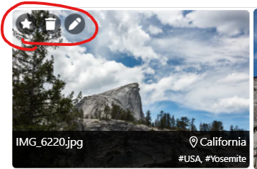

# pigallery2-sample-extension

Pigallery 2 extension example

Fork this project to build your own extension.


Usage:

```
npm install
npm run build
```

Also see extension documentation at https://github.com/bpatrik/pigallery2/tree/master/extension

------------------------------------------------------------------------

This sample extension adds the following and more: 

Three new buttons to the top left of the photo:
 * Great photo if the photo has 4+ stars
 * edit button for editing a photo
 * delete button for deleting a photo (only form db)
 * 

